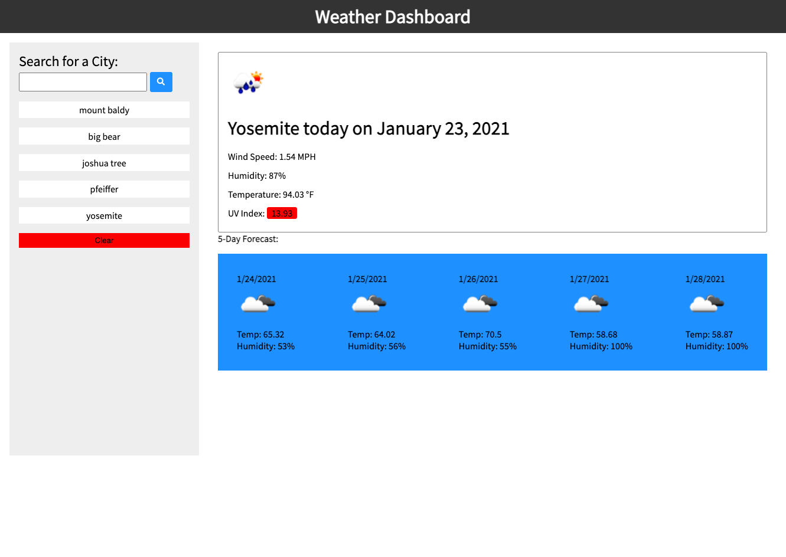

# WeatherToTravel

## Info
A traverler's guide to the weather of their city of choosing! When user enters a valid city in the search bar, they are returned with the current day weather, wind speed, humidity percentage, temperature and uv index(color coded). then they are returned with a 5 day forecast fo the weather for that certain city. User is able to search for another city in the search bar. Their history has been appended below the search bar and when clicked on, can be used to search again. A clear button sits below this area and is used for clearing their searches. 

## Link to webpage!
[Link to webpage here!](https://sksmejn.github.io/WeatherToTravel/)

## Screenshots!
